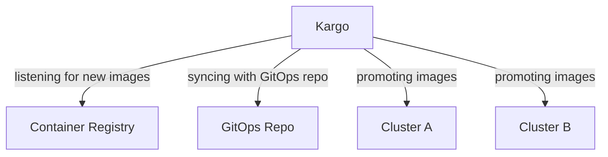

# Kargo Demo

Demo setting up a multicluster CI/CD pipeline with Kargo. This repo is intended to control multiple clusters

This repo uses [gitmoji](https://gitmoji.dev/) for commit messages.

## Environment

This demo will setup the following environment:



## Setup Kargo

### Cert Manager

Following the instructions in the [Kargo README](https://docs.kargo.io/how-to-guides/installing-kargo) to install Kargo.

Cert Manger is required for Kargo. Install it with the following command:

```bash
helm install cert-manager jetstack/cert-manager --namespace cert-manager --create-namespace --version v1.16.2 --set crds.enabled=true --set prometheus.enabled=false --set webhook.timeoutSeconds=4
```

### ArgoCD

ArgoCD is required for Kargo. Install it with the following command:

```bash
kubectl create namespace argocd
kubectl apply -n argocd -f https://raw.githubusercontent.com/argoproj/argo-cd/stable/manifests/install.yaml
```

Access the ArgoCD UI with the following command:

```bash
kubectl port-forward svc/argocd-server -n argocd 8080:443
```

Username is `admin` and password is the output from:

```bash
argocd admin initial-password -n argocd
```

### Argo Rollouts

```bash
kubectl create namespace argo-rollouts
kubectl apply -n argo-rollouts -f https://github.com/argoproj/argo-rollouts/releases/latest/download/install.yaml
```

### Kargo

```bash
helm install kargo \
  oci://ghcr.io/akuity/kargo-charts/kargo \
  --namespace kargo \
  --create-namespace \
  --set api.adminAccount.passwordHash='$2a$10$Zrhhie4vLz5ygtVSaif6o.qN36jgs6vjtMBdM6yrU1FOeiAAMMxOm' \
  --set api.adminAccount.tokenSigningKey=iwishtowashmyirishwristwatch \
  --wait
```

## Access Kargo UI

```bash 
kubectl port-forward svc/kargo-api -n kargo 8080:443
```

The password is `admin`.

## Accessing the ArgoCD UI

Get the initial password with the following command:
```bash
k get secrets argocd-initial-admin-secret -n argocd -o yaml
```

Ignore the last `%` in the password.

Then access the UI with the following command:

```bash
kubectl port-forward svc/argocd-server -n argocd 8080:443
```

## Kargo Docs Quickstart

- I then follow the [Kargo Docs Quickstart](https://docs.kargo.io/quickstart) to setup a new project.

## Resources

- [Platform Engineering](https://www.youtube.com/watch?v=0B_JODxyK0w&ab_channel=PlatformEngineering)
- [Kargo GA youtube](https://www.youtube.com/watch?v=GvGt0yuApvE&ab_channel=Akuity)

## Questions

This repo wants to answer the following questions:
- How to setup a multicluster CI/CD pipeline with Kargo?
- Do I need to install ArgoCD on each cluster?
- How does Kargo communicate with ArgoCD in each cluster?
-- Through K8s API. It pushes to the API server in each cluster. However, it still follow the GitOps model.
- How can I avoid a recursive loop when syncing the same repo in each cluster and making changes to the GitOps repo?
