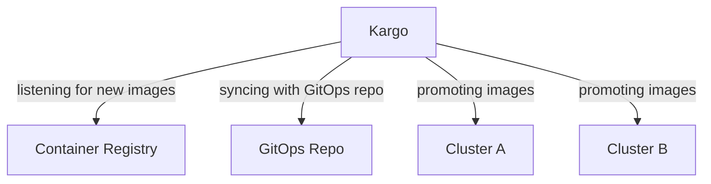

# Kargo Demo

Demo setting up a multicluster CI/CD pipeline with Kargo.

This repo uses [gitmoji](https://gitmoji.dev/) for commit messages.

## Environment

This demo will setup the following environment:

This diagram will evolve as I learn more about Kargo.

## Questions

This repo wants to answer the following questions:
- How to setup a multicluster CI/CD pipeline with Kargo?
- Do I need to install ArgoCD on each cluster?
- How does Kargo communicate with ArgoCD in each cluster?
- How can I avoid a recursive loop when syncing the same repo in each cluster and making changes to the GitOps repo?
